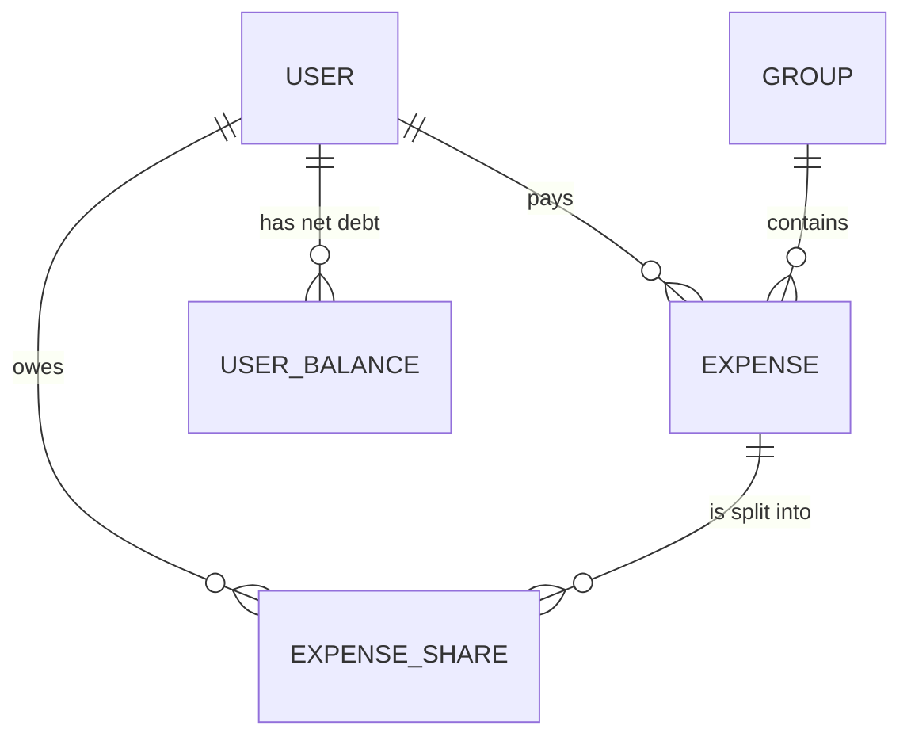
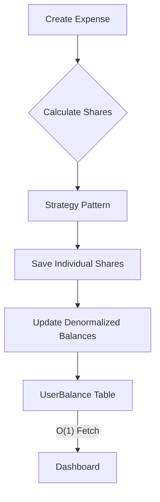
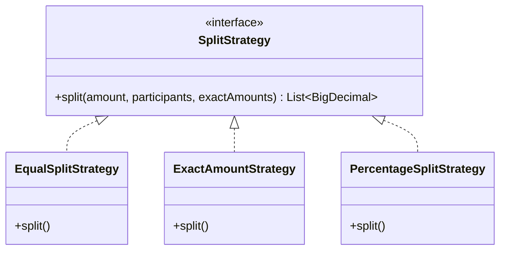

# Splitwise Core API (MVP)

[](https://spring.io/projects/spring-boot)
[](https://www.oracle.com/java/technologies/javase/jdk21-archive-downloads.html)
[](https://www.docker.com/)

A highly scalable, denormalized expense-sharing engine designed for precision and extensibility. This project demonstrates advanced architectural patterns used to handle large-scale financial transactions in a distributed environment.

## Engineering Philosophy: Speed vs. Quality

In high-growth engineering environments, rapid delivery is essential. To demonstrate a balance between speed and architectural integrity, this MVP was implemented in a few hours, with a focus on:
- **Automated Documentation**: Full OpenAPI/Swagger integration for instant API discovery.
- **Containerization**: Production-ready Docker & Docker Compose setup.
- **Scalable System Design**: Denormalized balance tracking and Strategy-based extensibility.

This showcases that rapid shipping can coexist with SOLID principles and operational excellence.

## 1. Financial Precision

Maintaining accuracy in financial calculations is paramount. Two key decisions were made:

- **Use of `BigDecimal`:** All monetary values are stored and calculated using `java.math.BigDecimal`. Floating-point types like `double` or `float` were strictly avoided to prevent precision loss (e.g., `0.1 + 0.2 != 0.3` in standard floating-point arithmetic).
- **Cent Distribution Algorithm:** When dividing expenses (e.g., $10.00 split among 3 people), the system does not lose cents. The `EqualSplitStrategy` calculates base shares rounded down and distributes the remainder cents to the first participants ensuring uniqueness and that `sum(shares) == total_amount`.
  - Example: $100 / 3 => $33.34, $33.33, $33.33.

## 2. Domain Model



## 3. System Design Decisions

### Scalability & Performance
To handle a scale of millions of users and transactions, this API avoids on-the-fly balance calculations. 



- **UserBalance Entity**: We maintain a denormalized table that stores the net balance between pairs of users. This transforms a heavy aggregation query into a simple indexed lookup.
- **Transactional Integrity**: All balance updates happen within the same database transaction as the expense creation, ensuring data consistency via `@Transactional`.

### Extensibility (SOLID)
Instead of bloated service classes, I implemented the **Strategy Pattern** for expense splitting.



- `SplitStrategy`: Interface defining the contract.
- `EqualSplitStrategy`: Handles rounding errors and remainder distribution (penny problem).
- `ExactAmountStrategy`: Handles specific user-defined amounts.
- `PercentageSplitStrategy`: Calculates shares based on % distribution.

This makes it trivial to add new split types (e.g., Shares) without modifying existing tested code.

## 4. Layered Architecture

We followed a strict layered architecture:
- **Controllers:** Pure delegates. They handle HTTP concerns (mapping, status codes) and delegate business logic immediately to Services.
- **Services:** encapsulate all business rules (e.g., creating users, calculating splits, updating balances transactionally).
- **DTOs vs Entities:** Validation annotations (`@NotNull`, `@Email`, etc.) are placed on DTOs to sanitise input at the API boundary, keeping JPA Entities focused on data persistence and schema definition.

## 5. Testing Strategy

Quality is ensured through a comprehensive testing pyramid:
- **Unit Tests**: Mathematical verification of all `SplitStrategy` implementations.
- **Service Layer Tests**: Business rule validation using Mockito to isolate external dependencies.
- **Integration Tests**: End-to-end API flows using **H2 (In-Memory)** for rapid feedback loops and **Testcontainers** (ready for roadmap) for production-parity verification.

```bash
# Run all tests
mvn test -s settings-local.xml
```

The entire stack (API + PostgreSQL) can be provisioned in two steps (recommended for environments with restricted Docker networking):

1. **Build the JAR locally** (Ensure Maven has internet/proxy access):
   ```bash
   mvn clean package -s settings-local.xml -DskipTests
   ```

2. **Run with Docker Compose**:
   ```bash
   docker compose up --build -d
   ```

> [!TIP]
> Use the provided automation script for a single-command setup:
> ```bash
> chmod +x build-and-run.sh
> ./build-and-run.sh
> ```

Once running, access the **Swagger UI** at: `http://localhost:8080/swagger-ui.html`
or run the automated test suite:
```bash
bash test-script.sh
```

## 7. Logging

SLF4J is used for logging critical business logic steps, such as the distribution of remainder cents in the splitting strategy, aiding in debugging and auditability.

## 8. Deep Dive: Equal Split Algorithm

One of the interesting challenges in splitting expenses is handling precision loss. For example, splitting $100.00 among 3 people results in $33.333... per person.
We cannot simply round to nearest, as $33.33 * 3 = $99.99, leaving 1 cent unaccounted for (or created out of thin air if rounded up).

Our `EqualSplitStrategy` handles this with an efficient O(N) approach:
1.  **Base Calculation**: Calculate `floor(Total / N)` to get the minimum share (e.g., $33.33).
2.  **Remainder Calculation**: `Total - (Base * N)` gives the remaining cents (e.g., $0.01).
3.  **Distribution**: We iterate through the participants and distribute the `remainder` cents, one by one, to the first `k` participants (where `k` is the number of remainder cents).

This guarantees that:
- `Sum(Shares) == TotalAmount` exactly.
- No participant pays more than 1 cent difference from any other.
- The operation remains linear `O(N)` with respect to the number of participants.

## 9. Production Readiness Roadmap

To take this MVP to a production environment, the following improvements are recommended:

### 1. Security
- **Authentication & Authorization:** Implement **Spring Security** with **JWT** (JSON Web Tokens) or OAuth2 (e.g., Keycloak/Auth0) to secure endpoints. Currently, the API is open.
- **HTTPS:** Enforce SSL/TLS encryption.
- **Secrets Management:** Use tools like AWS Secrets Manager or HashiCorp Vault instead of environment variables for sensitive credentials.

### 2. Database & Data Integrity
- **Migrations:** Replace Hibernate `ddl-auto: update` with version control tools like **Flyway** or **Liquibase** for predictable schema changes.
- **Connection Pooling:** Tune **HikariCP** settings for high throughput.
- **Caching:** Implement **Redis** (Second Level Cache) for frequently accessed data like User Balances.

### 3. Observability & Monitoring
- **Metrics:** Expose metrics via **Micrometer** for **Prometheus** and visualize in **Grafana**.
- **Distributed Tracing:** Integrate **OpenTelemetry** / **Zipkin** to trace requests across microservices.
- **Centralized Logging:** Ship logs to ELK Stack (Elasticsearch, Logstash, Kibana) or Datadog.

### 4. Infrastructure & DevOps
- **CI/CD:** Set up pipelines (GitHub Actions/GitLab CI) for automated testing and deployment.
- **Container Orchestration:** Deploy using **Kubernetes (K8s)** or AWS ECS for auto-scaling and high availability.
- **Resiliency:** Implement **Resilience4j** for Circuit Breakers and Rate Limiting to prevent cascading failures.
